# 🚀 APS — Accelerated Proxy Solution

[](LICENSE)
[](https://jdk.java.net/)
[](https://github.com/openjdk/jmh)

[中文版](README_CN.md) | [Benchmark Results](docs/benchmark-results.md)

A high-performance dynamic proxy library for Java, designed as a drop-in replacement for CGLib, using hashCode-based dispatch with direct `INVOKESPECIAL` super calls for near-zero interception overhead.

## ✨ Features

- **Zero-overhead super dispatch** — hashCode-driven `dispatch()` switch calls `super.method(args)` directly; no MethodHandle, no reflection, JIT-inlinable
- **Unified API** — single `AcceleratedProxy.proxy(target, interceptor)` entry point for both classes and interfaces
- **Interface proxy support** — generates runtime interface implementations at near-parity with `java.lang.reflect.Proxy`
- **No ClassLoader leaks** — uses `Lookup.defineHiddenClass()` so proxy classes are GC-eligible when no longer referenced
- **One-line API** — `AcceleratedProxy.proxy(MyClass.class, interceptor)` with generic type inference, no casts needed
- **Zero-overhead filtering** — methods excluded by `ClassFilter` call the superclass directly with no interception cost
- **Constructor arguments** — supports proxying classes without a no-arg constructor

## ⚡ Quick Start

### Class Proxy

```java
Greeter proxy = AcceleratedProxy.proxy(Greeter.class, (obj, method, args) -> {
    System.out.println("before " + method.getName());
    Object result = AcceleratedProxy.invokeSuper(obj, method, args);
    System.out.println("after " + method.getName());
    return result;
});

String greeting = proxy.hello("World");
// prints: before hello
// prints: after hello
// greeting = "Hello, World"
```

### Interface Proxy

```java
Calculator calc = AcceleratedProxy.proxy(Calculator.class, (obj, method, args) -> {
    System.out.println("calling " + method.getName());
    // implement custom logic, or return a canned response
    return 42;
});

int result = calc.add(10, 20);
// prints: calling add
// result = 42
```

## 📊 Performance

JMH benchmarks on Java 25. Best result per row **bolded**.  
*Java Proxy cannot proxy classes; included for reference only (proxies the interface, delegates via reflection).*

### Class Proxy Highlights

| Scenario          | Direct    | APS      | CGLib    |
|-------------------|-----------|----------|----------|
| int return        | **0.66**  | 1.83     | 12.36    |
| String return     | **4.68**  | 4.71     | 19.89    |
| void return       | **0.65**  | 3.94     | 3.72     |
| 0-arg passthrough | **0.66**  | 2.11     | 3.96     |
| 4-arg passthrough | **56.34** | 61.32    | 71.38    |
| No-op             | —         | 1.32     | **1.05** |
| Passthrough       | —         | **4.76** | 14.01    |
| Arg modify        | —         | **5.33** | 18.69    |

### Interface Proxy Highlights

| Scenario      | APS      | Java Proxy |
|---------------|----------|------------|
| int return    | 1.30     | **1.05**   |
| String return | **5.69** | 5.77       |
| void return   | 1.30     | **1.05**   |
| No-op         | 1.31     | **1.05**   |
| Passthrough   | **5.69** | 5.77       |
| Arg modify    | 5.30     | **5.29**   |

*ns/op, lower is better. Full results: [docs/benchmark-results.md](docs/benchmark-results.md)*

## 🏗️ How It Works

### 1. Proxy Class Generation

The following flowchart illustrates how APS generates a dynamic proxy class at runtime — from the `AcceleratedProxy.proxy()` call to returning a ready-to-use proxy instance.

```mermaid
flowchart TD
    A["&#9322; AcceleratedProxy.proxy(target, interceptor, filter, constructorArgs)"]
    A --> B{"target.isInterface()?"}
    B -->|" &#10003; Interface "| C["&#9323; InterfaceGenerator(target, filter)"]
    B -->|" &#10007; Class "| D["&#9323; ClassGenerator(target, filter, constructorArgs)"]
    C --> E["&#9324; InterfaceGenerator.generate()"]
    D --> F["&#9324; ClassGenerator.generate()"]
    E --> G["Init ASM ClassWriter"]
    G --> H["Define class: extends Object<br/>implements Target, DispatchTarget"]
    H --> I["Generate _callback field (Interceptor)"]
    I --> J["Generate constructor &lt;init&gt;<br/>store Interceptor reference"]
    J --> K["Iterate interface methods"]
    K --> L{"ClassFilter.accept(method)?"}
    L -->|" &#10003; Intercept "| M["Generate method body<br/>call interceptor.intercept"]
    L -->|" &#10007; Skip "| N["Generate method body<br/>throw AbstractMethodError"]
    M --> O["Register Method info in ClinitRegistry"]
    N --> P{"More methods?"}
    O --> P
    P -->|" Yes "| K
    P -->|" No "| Q["&#9325; Drain ClinitRegistry &rarr; MethodInfo list"]
    Q --> R["&#9326; Generate dispatch(Method, Object[]) method<br/>hashCode-driven if-else chain"]
    R --> S["&#9327; Generate &lt;clinit&gt; static initializer<br/>load java.lang.reflect.Method via reflection"]
    S --> T["&#9328; ClassWriter.toByteArray() &rarr; byte[]"]
    F --> G2["Init ASM ClassWriter"]
    G2 --> H2["Define class: extends TargetClass<br/>implements DispatchTarget"]
    H2 --> I2["Generate _callback field (Interceptor)"]
    I2 --> J2["Find matching super constructor"]
    J2 --> K2["Generate constructor &lt;init&gt;<br/>super(constructorArgs) + store Interceptor"]
    K2 --> L2["Iterate non-final / non-static<br/>declared methods"]
    L2 --> M2{"ClassFilter.accept(method)?"}
    M2 -->|" &#10003; Intercept "| N2["Generate override body<br/>call interceptor.intercept"]
    M2 -->|" &#10007; Skip "| O2["Generate override body<br/>direct super.method() zero overhead"]
    N2 --> P2["Register in ClinitRegistry"]
    O2 --> Q2{"More methods?"}
    P2 --> Q2
    Q2 -->|" Yes "| L2
    Q2 -->|" No "| R2["&#9325; Drain ClinitRegistry &rarr; MethodInfo list"]
    R2 --> S2["&#9326; Generate dispatch(Method, Object[]) method<br/>hashCode-driven if-else &rarr; INVOKESPECIAL super"]
    S2 --> T2["&#9327; Generate &lt;clinit&gt; static initializer"]
    T2 --> T
    T --> U{"target.isInterface()?"}
    U -->|" Interface "| V["&#9329; Use APS own Lookup<br/>defineHiddenClass(bytecode, true)"]
    U -->|" Class "| W["&#9329; LookupManager acquires<br/>target package access Lookup<br/>defineHiddenClass(bytecode, true)"]
    V --> X["&#9330; Reflectively get constructor"]
    W --> X
    X --> Y["&#9331; Constructor.newInstance<br/>Interface: (interceptor)<br/>Class: (interceptor, constructorArgs...)"]
    Y --> Z["Return proxy instance"]
```



### 2. Method Invocation

When a method is called on the proxy instance, the following flow executes — from the generated bytecode through user interceptor logic to the final return value.

```mermaid
flowchart TD
    A["&#9322; Method call on proxy<br/>proxy.someMethod(arg1, arg2)"]
    A --> B["&#9323; Enter generated override body"]
    B --> C["&#9324; Box arguments<br/>primitive &rarr; wrapper type<br/>Object[] args = new Object[]{arg1, arg2, ...}"]
    C --> D["&#9325; Call Interceptor.intercept(proxy, method, args)<br/>this._callback.intercept(this, _method, args)"]
    D --> E["User-defined Interceptor logic"]
    E --> F{"Need to invoke super?"}
    F -->|" Yes "| G["&#9326; AcceleratedProxy.invokeSuper(proxy, method, args)"]
    F -->|" No "| H["Return custom result"]
    G --> I["&#9327; ((DispatchTarget) proxy).dispatch(method, args)"]
    I --> J["&#9328; Compute method.hashCode()"]
    J --> K["&#9329; hashCode-driven if-else chain<br/>compare: hash == METHOD_N_HASH ?"]
    K --> L["&#9330; Branch hit &rarr; unbox args<br/>extract from Object[] and unbox to primitives"]
    L --> M["&#9331; INVOKESPECIAL super.method(args...)<br/>direct bytecode-level super call<br/>zero reflection, zero MethodHandle"]
    M --> N["Box return value (if needed)<br/>primitive &rarr; wrapper type"]
    N --> H
    H --> O["Unbox return & type check<br/>wrapper &rarr; primitive (if needed)<br/>CHECKCAST reference type"]
    O --> P{"Exception thrown?"}
    P -->|" RuntimeException "| Q["Rethrow directly"]
    P -->|" Error "| R["Rethrow directly"]
    P -->|" Checked Exception "| S["Wrap in UndeclaredThrowableException<br/>and throw"]
    P -->|" No exception "| T["Return result to caller"]
    Q --> U["Caller catches exception"]
    R --> U
    S --> U
```



> **Key insight:** The `dispatch()` method uses a compile-time-computed `Method.hashCode()` (deterministic: `declaringClass.hashCode() XOR methodName.hashCode()`) to build an if-else chain. Each branch directly emits `INVOKESPECIAL super.method(args...)` — there is **zero reflection** and **zero MethodHandle** overhead at dispatch time. The JIT compiler can inline these direct super calls, achieving near-native performance.

## 📋 Requirements

- Java 25+
- ASM 9.7.1 (declared as compile dependency)

## 📦 Installation

### Build from source

```bash
git clone https://github.com/lamspace/aps.git
cd aps
mvn install -DskipTests
```

### Maven (coming soon)

```xml

<dependency>
    <groupId>io.github.lamspace</groupId>
    <artifactId>aps</artifactId>
    <version>0.1.0-SNAPSHOT</version>
</dependency>
```

Maven Central publishing is on the [roadmap](docs/aps-future-roadmap.md).

## 🆚 APS vs CGLib

| Feature                        | APS                               | CGLib                      |
|--------------------------------|-----------------------------------|----------------------------|
| Dispatch mechanism             | hashCode switch + `INVOKESPECIAL` | Generated bytecode         |
| Super call overhead            | Zero (direct `super.method()`)    | MethodProxy + FastClass    |
| Class loading                  | `defineHiddenClass()` (GC-safe)   | Custom ClassLoader         |
| API style                      | Functional (`Interceptor` lambda) | Callback + MethodProxy     |
| Interface proxy                | Yes (`AcceleratedProxy.proxy()`)  | No (requires Objenesis)    |
| Primitive boxing               | Automatic                         | Automatic                  |
| Exception propagation          | Checked → `UndeclaredThrowable`   | Checked → InvocationTarget |
| No-default-constructor support | Yes                               | Yes                        |
| Final class/method proxy       | No (JVM limit)                    | No (JVM limit)             |
| Maven Central                  | Roadmap                           | Yes                        |

## 🆚 APS vs Java Proxy

| Feature                     | APS                                 | `java.lang.reflect.Proxy`                |
|-----------------------------|-------------------------------------|------------------------------------------|
| Proxy target                | Classes **and** interfaces          | Interfaces only                          |
| Dispatch mechanism          | hashCode switch + `INVOKESPECIAL`   | Generated bytecode + `InvocationHandler` |
| Super call overhead         | Zero (direct `super.method()`)      | N/A (interfaces only)                    |
| Class loading               | `defineHiddenClass()` (GC-safe)     | `defineClass` + proxy cache              |
| API style                   | Functional (`Interceptor` lambda)   | `InvocationHandler` (single-method)      |
| Selective interception      | `ClassFilter` per method            | All-or-nothing                           |
| Exception propagation       | Checked → `UndeclaredThrowable`     | Checked → `InvocationTarget`             |
| Constructor args (classes)  | Yes                                 | N/A (interfaces only)                    |
| Class proxy performance     | ~5.69 ns passthrough (direct speed) | N/A (cannot proxy classes)               |
| Interface proxy performance | Near-parity (~0.25ns gap)           | Slight edge (JIT intrinsics)             |
| Dependencies                | Third-party (APS + ASM)             | Built into JDK                           |

## 🔄 Migration from CGLib

See [docs/migration-guide.md](docs/migration-guide.md) for step-by-step migration guides from both CGLib and `java.lang.reflect.Proxy`.

## 📖 Documentation

- [Benchmark Results (EN)](docs/benchmark-results.md)
- [Benchmark Results (中文)](docs/benchmark-results_cn.md)
- [Migration Guide](docs/migration-guide.md)
- [Design Spec](docs/superpowers/specs/2026-08-02-aps-unified-proxy-design.md)
- [Future Roadmap](docs/aps-future-roadmap.md)

## 📄 License

Apache License 2.0
