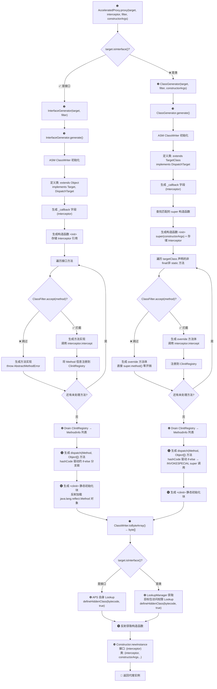
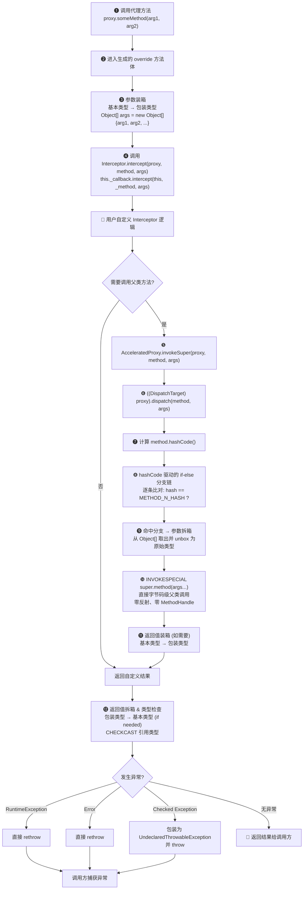

# 🚀 APS — 加速代理解决方案

[](LICENSE)
[](https://jdk.java.net/)
[](https://github.com/openjdk/jmh)

[English](README.md) | [基准测试报告](docs/benchmark-results_cn.md)

高性能 Java 动态代理库，基于哈希码调度 + 直接 `INVOKESPECIAL` 父类调用，实现近零拦截开销，可作为 CGLib 的替代方案。

## ✨ 特性

- **零开销父类调度** — hashCode 驱动的 `dispatch()` 开关直接调用 `super.method(args)`；无 MethodHandle、无反射、JIT 可内联
- **统一 API** — 单一入口 `AcceleratedProxy.proxy(target, interceptor)` 同时支持类和接口
- **接口代理支持** — 运行时生成接口实现，性能与 `java.lang.reflect.Proxy` 接近持平
- **无 ClassLoader 泄漏** — 使用 `Lookup.defineHiddenClass()`，代理类在无引用时可被 GC 回收
- **一行代码** — `AcceleratedProxy.proxy(MyClass.class, interceptor)` 泛型自动推导，无需手动转型
- **零开销过滤** — `ClassFilter` 排除的方法直接调用父类，无任何拦截开销
- **构造参数支持** — 支持代理无默认构造方法的类

## ⚡ 快速开始

### 类代理

```java
Greeter proxy = AcceleratedProxy.proxy(Greeter.class, (obj, method, args) -> {
    System.out.println("调用前 " + method.getName());
    Object result = AcceleratedProxy.invokeSuper(obj, method, args);
    System.out.println("调用后 " + method.getName());
    return result;
});

String greeting = proxy.hello("World");
// 输出: 调用前 hello
// 输出: 调用后 hello
// greeting = "Hello, World"
```

### 接口代理

```java
Calculator calc = AcceleratedProxy.proxy(Calculator.class, (obj, method, args) -> {
    System.out.println("正在调用 " + method.getName());
    // 实现自定义逻辑，或返回预设值
    return 42;
});

int result = calc.add(10, 20);
// 输出: 正在调用 add
// result = 42
```

## 📊 性能

JMH 基准测试 | Java 25。每行最优结果 **加粗**标注。  
*Java Proxy 无法代理类；保留此列仅作参考（代理接口，通过反射委托）。*

### 类代理（摘要）

| 场景          | 直接调用  | APS      | CGLib    |
|---------------|-----------|----------|----------|
| int 返回值    | **0.66**  | 1.83     | 12.36    |
| String 返回值 | **4.68**  | 4.71     | 19.89    |
| void 返回值   | **0.65**  | 3.94     | 3.72     |
| 0 参数透传    | **0.66**  | 2.11     | 3.96     |
| 4 参数透传    | **56.34** | 61.32    | 71.38    |
| 空操作        | —         | 1.32     | **1.05** |
| 透传          | —         | **4.76** | 14.01    |
| 参数修改      | —         | **5.33** | 18.69    |

### 接口代理（摘要）

| 场景          | APS      | Java Proxy |
|---------------|----------|------------|
| int 返回值    | 1.30     | **1.05**   |
| String 返回值 | **5.69** | 5.77       |
| void 返回值   | 1.30     | **1.05**   |
| 空操作        | 1.31     | **1.05**   |
| 透传          | **5.69** | 5.77       |
| 参数修改      | 5.30     | **5.29**   |

*单位: ns/op，越低越好。完整报告：[docs/benchmark-results_cn.md](docs/benchmark-results_cn.md)*

## 🏗️ 工作原理

### 1. 代理类生成流程

下图展示了 APS 如何在运行时生成动态代理类 —— 从调用 `AcceleratedProxy.proxy()` 到返回就绪的代理实例。



### 2. 方法调用流程

对代理实例发起方法调用时，以下流程被执行 —— 从生成的字节码出发，经过用户拦截器逻辑，最终返回结果。



> **核心洞察：** `dispatch()` 方法使用编译期预计算的 `Method.hashCode()`（确定性计算：`declaringClass.hashCode() XOR methodName.hashCode()`）构建 if-else 分支链。每个分支直接生成 `INVOKESPECIAL super.method(args...)` —— 调度时 **零反射**、 **零 MethodHandle** 开销。JIT 编译器可直接内联这些父类调用，实现接近原生的调用性能。

## 📋 环境要求

- Java 25+
- ASM 9.7.1（编译依赖）

## 📦 安装

### 源码构建

```bash
git clone https://github.com/lamspace/aps.git
cd aps
mvn install -DskipTests
```

### Maven（即将上线）

```xml

<dependency>
    <groupId>io.github.lamspace</groupId>
    <artifactId>aps</artifactId>
    <version>0.1.0-SNAPSHOT</version>
</dependency>
```

Maven Central 发布已列入[路线图](docs/aps-future-roadmap.md)。

## 🆚 APS vs CGLib

| 特性               | APS                                | CGLib                       |
|--------------------|------------------------------------|-----------------------------|
| 调度机制           | hashCode 开关 + `INVOKESPECIAL`    | 生成字节码                  |
| 父类调用开销       | 零（直接 `super.method()`）        | MethodProxy + FastClass     |
| 类加载             | `defineHiddenClass()`（GC 安全）   | 自定义 ClassLoader          |
| API 风格           | 函数式（`Interceptor` lambda）     | 回调 + MethodProxy          |
| 接口代理           | 支持（`AcceleratedProxy.proxy()`） | 不支持（需 Objenesis）      |
| 原语装箱           | 自动                               | 自动                        |
| 异常传播           | 受检异常 → `UndeclaredThrowable`   | 受检异常 → InvocationTarget |
| 无默认构造方法支持 | 支持                               | 支持                        |
| final 类/方法代理  | 不支持（JVM 限制）                 | 不支持（JVM 限制）          |
| Maven Central      | 规划中                             | 已有                        |

## 🆚 APS vs Java Proxy

| 特性           | APS                              | `java.lang.reflect.Proxy`        |
|----------------|----------------------------------|----------------------------------|
| 代理目标       | 类**和**接口                     | 仅接口                           |
| 调度机制       | hashCode 开关 + `INVOKESPECIAL`  | 生成字节码 + `InvocationHandler` |
| 父类调用开销   | 零（直接 `super.method()`）      | 不适用（仅接口）                 |
| 类加载         | `defineHiddenClass()`（GC 安全） | `defineClass` + 代理缓存         |
| API 风格       | 函数式（`Interceptor` lambda）   | `InvocationHandler`（单方法）    |
| 选择性拦截     | `ClassFilter` 按方法             | 全部或无                         |
| 异常传播       | 受检异常 → `UndeclaredThrowable` | 受检异常 → `InvocationTarget`    |
| 构造参数（类） | 支持                             | 不适用（仅接口）                 |
| 类代理性能     | ~5.69 ns 透传（直接调用级别）    | 不适用（无法代理类）             |
| 接口代理性能   | 接近持平（~0.25ns 差距）         | 略优（JIT 内在优化）             |
| 依赖           | 第三方（APS + ASM）              | JDK 内置                         |

## 🔄 从 CGLib 迁移

请参阅 [docs/migration-guide.md](docs/migration-guide.md) 了解从 CGLib 和 `java.lang.reflect.Proxy` 的分步迁移指南。

## 📖 文档

- [基准测试报告（中文）](docs/benchmark-results_cn.md)
- [基准测试报告（英文）](docs/benchmark-results.md)
- [迁移指南](docs/migration-guide.md)
- [设计文档](docs/superpowers/specs/2026-08-02-aps-unified-proxy-design.md)
- [未来路线图](docs/aps-future-roadmap.md)

## 📄 许可证

Apache License 2.0
